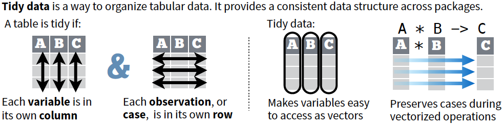

```{r setup, include=FALSE}
# knitr::opts_chunk$set(echo = TRUE)
knitr::opts_chunk$set(message=FALSE, warning=FALSE)
```


## Learning goals

1. Recognize common patterns in data wrangling tasks.

2. Use methods in the tidyverse to carry out data wrangling.


## Example datasets

```{r, warning=FALSE, message=FALSE}
load("../data/adv-R-twin.RData")
```

Liu et al., Quantitative variability of 342 plasma proteins in a human twin population, *Molecular Systems Biology*, 2015. [PMID: 25652787]

* The dataset contains `r length(unique(twin_dia$run))` MS runs of plasma samples:
    - `r length(unique(twin_dia$pair))` pairs of monozygotic (MZ) and dizygotic (DZ) twins
    - `r length(unique(twin_dia$visit))` time points
    - $58 \times 2 \times 2 = 232$

* Data were acquired with MS workflows of:
    - data independent acquisition (DIA)
    - selected reaction monitoring (SRM)

* We use a subset of the original dataset (with `r length(unique(twin_dia$protein))` proteins by DIA and `r length(unique(twin_srm$protein))` proteins by SRM).

```{r}
str(twin_dia)
```

The two data frames have the same format, containing 9 columns:

* `protein` (chr): protein name.
* `feature` (chr): combination of peptide, precursor charge state, fragment ion, and product charge state, separated by `_`.
* `run` (chr): MS run identifier (R001-R232).
* `pair` (int): pair identifier number (1-58).
* `zygosity` (factor): zygosity (MZ, DZ).
* `subject` (int): subject identifier number (1-116).
* `visit` (int): time of visit (1, 2).
* `intensity_l` (num): integrated feature intensity from light (L) channel.
* `intensity_h` (num): integrated feature intensity from heavy (H, aka reference) channel.

```{r}
head(twin_dia)
head(twin_srm)
```


## Tasks

* **Task 1:** normalize feature intensities, in a way that the median of reference feature intensities is identical across runs.
* **Task 2:** evaluate the agreement between the DIA and SRM datasets in terms of protein quantification.

We will discuss tools in the **tidyverse** to address the tasks. In particular, how to tidy up messy datasets, manipulate and transform data, carry out the split-apply-combine approach, and join datasets in a consistent fashion.


## Tidyverse

```{r}
library(tidyverse)
```

The [tidyverse](http://tidyverse.org/) is a collection of R packages that share common data representation and [design principles](http://tidyverse.tidyverse.org/articles/manifesto.html). It is designed to make data analysis easier. `library(tidyverse)` loads eights core packages: [ggplot2](http://ggplot2.tidyverse.org/), [dplyr](http://dplyr.tidyverse.org/), [tidyr](http://tidyr.tidyverse.org/), [readr](http://readr.tidyverse.org/), [purrr](http://purrr.tidyverse.org/), [tibble](http://tibble.tidyverse.org/), [stringr](http://stringr.tidyverse.org/), [forcats](http://forcats.tidyverse.org/). These packages provide functions that are involved in most data analysis projects. We will introduce core functions in **tidyr** and **dplyr**, and touch on a few aspects of tibble, purrr and ggplot2. There are other packages in the tidyverse focusing on different aspects of data analysis that you may find useful. For example, stringr for strings, and broom for model objects that we will also discuss. 

```{r, out.width=600, echo=FALSE, fig.align='center'}
knitr::include_graphics("http://r4ds.had.co.nz/diagrams/data-science.png")
```


### Helpful conventions 

`as_tibble()` creates a **tibble** (`tbl_df`) from an existing data frame: 

```{r}
twin_dia <- as_tibble(twin_dia)
twin_srm <- as_tibble(twin_srm)
```

Tibbles are special data frames, which have an enhanced print method that shows the content nicely on the console: 

```{r}
class(twin_dia)
twin_dia
```

The **pipe operator** `%>%` (from magrittr) to chain multiple operations: 

```{r, eval=FALSE}
# Equivalent representations
FUN(X, Y)
X %>% FUN(Y)
```

```{r, eval=FALSE}
# Chaining two operations
FUN_2( FUN_1(X, Y), Z )
X %>% FUN_1(Y) %>% FUN_2(Z)
```

When your operation involves a sequence of multiple function calls, this makes the action taken at each step and the whole analysis flow easier to understand. 

The keyboard shortcut for `%>%` in RStudio: 

* Ctrl + Shift + M (Windows)
* Cmd + Shift + M (Mac).


## Tidy data

The tidyverse is built around **tidy data** stored in **tibbles**. A dataset is tidy if:

* Each **variable** is saved in its own **column**.
* Each **observation** is saved in its own **row**.
* Each type of observational unit is stored in a single table.

```{r, out.width=625, echo=FALSE, fig.align='center'}
knitr::include_graphics("http://r4ds.had.co.nz/images/tidy-1.png")
```

Tidy data complements R's **vectorized operations**. It is easy to access variables in a tidy dataset, and R will automatically preserve observations as you manipulate variables.

```{r, out.width=600, echo=FALSE, fig.align='center'}

```

Are the datasets of the case study `twin_dia` and `twin_srm` tidy? Let's look at a few examples with values for 2 proteins (APOA, C1QA) and 3 samples (R001, R002, R003) from the SRM dataset.

```{r, echo=FALSE}
# Making untidy data
td_sub <- as_tibble(twin_srm) %>% 
    select(protein, feature, run, intensity_h, intensity_l) %>% 
    filter(run %in% c("R001", "R002", "R003"), protein %in% c("APOA", "C1QA"))

sub1a <- td_sub %>% select(-intensity_l) %>% spread(run, intensity_h, convert = F)
sub1b <- td_sub %>% select(-intensity_h) %>% spread(run, intensity_l, convert = F)
sub2 <- td_sub %>% gather(key = "label", value = "intensity", intensity_h, intensity_l) %>% 
    mutate(label = ifelse(label == "intensity_h", "heavy", "light")) %>% 
    arrange(protein, feature, run, label)
sub12 <- sub2 %>% spread(key = run, value = intensity)
sub3 <- td_sub %>% unite(intensity_both, intensity_h, intensity_l, sep = "/")
```


```{r}
# Subset for heavy channel
sub1a
# Subset for light channel
sub1b
```

In `sub1a` and `sub1b`, some of the column names (`R001`, `R002`, `R003`) are values of a variable, rather than variables.

```{r}
sub2
```

As for `sub2`, people may have different opinions on whether it is tidy, based on the basic unit to be processed: 

* It is **tidy**, if you view *a feature in a channel (light or heavy) in one run, i.e., a peak* as an observation.

* It is **not tidy**, if you view *a feature in one run* as an observation, which is scattered across two rows.

We'll take the second view.

```{r}
sub12
```

`sub12` is a case with both issues.

```{r}
sub3
```

The `intensity_both` column in `sub3` contains both `intensity_h` and `intensity_l` variables, and values are saved as strings.

## tidyr

A package that helps reshape the layout of tabular datasets.

* Gather multiple columns into a key-value pair with `tidyr::gather()`.
* Spread a key-value pair into multiple columns with `tidyr::spread()`.
* Split and merge columns with `tidyr::separate()` and `tidyr::unite()`.


### Use `gather()` to gather multiple columns into a key-value pair

`gather()` moves column names into a **key** column, and gathers the column values into a single **value** column.

```{r}
sub1a
```

To tidy up this dataset, we need to gather the **value**s of feature intensities (in columns `R001`, `R002`, and `R003`) into a single variable `intensity_h`, and create a new variable `run`, a **key** relating the feature to its originating run:

```{r}
# gather(sub1a, key = run, value = intensity_h, R001, R002, R003)
sub1a %>% gather(key = run, value = intensity_h, R001, R002, R003)
```

Other ways to inform the function to gather columns `R001`, `R002`, and `R003`:

```{r, eval=F}
# With numeric indexes
sub1a %>% gather(key = run, value = intensity_h, 3:5)

# Columns to be excluded
sub1a %>% gather(key = run, value = intensity_h, -protein, -feature)
```

Apply for both `sub1a` and `sub1b` and merge the results: 

```{r}
tidy1a <- sub1a %>% gather(key = run, value = intensity_h, R001, R002, R003)
tidy1b <- sub1b %>% gather(key = run, value = intensity_l, R001, R002, R003)
merge(tidy1a, tidy1b)  # merge two parts of the dataset
```


### Use `spread()` to spread a key-value pair into multiple columns

`spread()` moves the unique values of a **key** column onto the column names, and spreads the values of a **value** column to their corresponding columns.

```{r}
sub2
```

To tidy up this dataset, we need to spread the values of the `intensity` column, into multiple columns named with the unique values of `label` column: 

```{r}
# spread(sub2, key = label, value = intensity)
sub2 %>% spread(key = label, value = intensity)
```

In some cases, both `gather()` and `spread()` are needed to tidy up data.

```{r}
sub12
```

```{r}
sub12 %>% gather(run, intensity, R001, R002, R003)
sub12 %>% 
    gather(run, intensity, R001, R002, R003) %>% 
    spread(key = label, value = intensity) %>% 
    dplyr::rename(intensity_h = heavy, intensity_l = light)
```


### Use `separate()` to split a column with a separator

```{r}
sub3 %>% 
    separate(col = intensity_both, into = c("intensity_h", "intensity_l"), sep = "/")
```

Separator between columns:

* If character, is interpreted as a regular expression.
* If numeric, is interpreted as positions to split at. 

Try to convert to better types using `convert = TRUE`, as in 

```{r, eval=FALSE}
sub3 %>% 
    separate(col = intensity_both, into = c("intensity_h", "intensity_l"), sep = "/", convert = TRUE)
```

Separate `intensity_both` and `feature` columns:

```{r}
sub3 %>% 
    separate(col = intensity_both, into = c("intensity_h", "intensity_l"), sep = "/", convert = TRUE) %>%
    separate(col = feature, into = c("peptide", "z1", "fragment", "z3"), sep = "_")
```


### Use `unite()` to merge columns into a single column

```{r}
sub3 %>% 
    separate(col = intensity_both, into = c("intensity_h", "intensity_l"), sep = "/", convert = TRUE) %>%
    separate(col = feature, into = c("peptide", "z1", "fragment", "z3"), sep = "_") %>% 
    unite(col = transition, z1, fragment, z3, sep = "_")
```


## dplyr

A package that helps manipulate and transform tabular data. 

* Reshape a dataset (without changing its content):
    - Rename the columns of a data frame with `dplyr::rename()`.
    - Order rows by values of columns with `dplyr::arrange()`.

* Data manipulation and transformation for a single dataset:
    - Extract existing variables with `dplyr::select()`.
    - Extract existing observations with `dplyr::filter()`.
    - Add new variables with `dplyr::mutate()`.
    - Make grouped summaries with `dplyr::summarise()` and `dplyr::group_by()`.

* Join datasets:
    - Mutating joins with `dplyr::left_join()`, `dplyr::right_join()`, `dplyr::inner_join()`, `dplyr::full_join()`.
    - Filtering joins `dplyr::semi_join()`, `dplyr::anti_join()`.


### Use `rename()` to rename columns

```{r}
# Rename column intensity_h as inty_H, intensity_l as inty_L
twin_dia %>% rename(inty_H = intensity_h, inty_L = intensity_l)
```


### Use `arrange()` to order rows 

```{r}
# Order rows by values of columns protein, run, and feature
twin_dia %>% arrange(protein, run, feature)

# Order rows by values of column subject, from high to low
twin_dia %>% arrange(desc(subject))
```


### Use `select()` to extract existing variables

```{r}
# Select columns protein and feature
twin_dia %>% select(protein, feature)

# Exclude column pair
twin_dia %>% select(-pair)

# Select from column feature to column intensity_h
twin_dia %>% select(feature:intensity_h)
```

This is helpful to obtain unique values for particular variables, for example: 

```{r}
twin_dia %>% 
    select(protein, feature) %>% 
    distinct()
```

```{r, eval=FALSE}
# Same as
twin_dia %>% distinct(protein, feature)
```

#### Useful functions work inside `select()`

* `starts_with()`, `ends_with()`, `contains()`
* `matches()`
* `num_range()`
* `one_of()`
* `everything()`

```{r, eval=FALSE}
# Select columns that contain `intensity`
twin_dia %>% 
    select(contains("intensity"))
```

```{r, eval=FALSE}
# Reorder to place column `run` at the beginning, followed by all others
twin_dia %>% 
    select(run, everything())
```


### Use `filter()` to extract existing observations

We select only the last four columns to print the result:

```{r}
twin_dia %>% filter(!is.na(intensity_h)) %>% 
    select(subject:intensity_l)

# Comma as AND operation
twin_dia %>% filter(is.na(intensity_h), !is.na(intensity_l)) %>% 
    select(subject:intensity_l)
```

#### Useful filter functions

* `==`, `>`, `>=`, etc
* `&`, `|`, `!`, `xor()`
* `is.na()`
* `between()`, `near()`

`between(x, left, right)` is a shortcut for `x >= left & x <= right`:

```{r, eval=F}
twin_dia %>% 
    filter(between(intensity_l, 1000, 1100))
```


### Use `mutate()` to add new variables

`mutate()` uses **window functions**, functions that take a vector of values and return another vector of the same length.

```{r}
# Log2 transformation
twin_dia %>% mutate(log2inty_l = log2(intensity_l))

# Use the just generated variables
twin_dia %>% 
    mutate(
        log2inty_h = log2(intensity_h), 
        log2inty_l = log2(intensity_l), 
        log2inty_d = log2inty_l - log2inty_h
    )
```

#### Useful window functions

* `+`, `-`, etc
* `log()`
* `lead()`, `lag()`
* `dense_rank()`, `min_rank()`, `percent_rank()`, `row_number()`, `cume_dist()`, `ntile()`
* `cumsum()`, `cummean()`, `cummin()`, `cummax()`, `cumany()`, `cumall()`
* `na_if()`, `coalesce()`
* `if_else()`, `recode()`, `case_when()`

`recode()` is a vectorized version of `switch()`:

```{r, eval=F}
twin_dia %>% 
    mutate(zygosity = recode(zygosity, MZ = "monozygotic", DZ = "dizygotic"))
```

Use `case_when()` to vectorize multiple `if` and `else if` statements:

```{r, eval=F}
twin_dia %>% 
    mutate(inty_cat = case_when(
        intensity_l < 1000 ~ "low-intensity", 
        between(intensity_l, 1000, 30000) ~ "mid-intensity", 
        intensity_l > 10000 ~ "high-intensity"
    ))
```


### Use `group_by()` and `summarise()` to make grouped summaries

* `summarise()` uses **summary functions**, functions that take a vector of values and return a single value.

* `group_by()` defines the unit of analysis by adding grouping information that can be recognized by `summarise()`. `ungroup()` removes grouping.


#### Useful summary functions

* Location: `mean()`, `median()`
* Spread: `sd()`, `IQR()`, `mad()`
* Range: `min()`, `max()`, `quantile()`
* Position: `first()`, `last()`, `nth()`
* Count: `n()`, `n_distinct()`
* Logical: `any()`, `all()`


```{r}
# Compute mean, sd and median of values in column intensity_l
twin_dia %>% 
    summarise(
        intensity_ave = mean(intensity_l, na.rm = TRUE), 
        intensity_sd = sd(intensity_l, na.rm = TRUE), 
        intensity_med = median(intensity_l, na.rm = TRUE)
    )
```

```{r}
# Compute mean, sd and median of values in column intensity_l, within each run
twin_dia %>% 
    group_by(run) %>% 
    summarise(
        intensity_ave = mean(intensity_l, na.rm = TRUE), 
        intensity_sd = sd(intensity_l, na.rm = TRUE), 
        intensity_med = median(intensity_l, na.rm = TRUE)
    )
```

`group_by()` + `summarise()` serve as a powerful tool for the split-apply-combine approach. To compute the quantities for median adjusted normalization (**Task 1**):

```{r}
# Equalizing medians
twin_dia %>% 
    mutate(log2inty_h = log2(intensity_h)) %>% 
    group_by(run) %>% 
    summarise(log2inty_med = median(log2inty_h, na.rm = TRUE)) %>% 
    mutate(log2inty_adj = median(log2inty_med) - log2inty_med)
```

In the next session, we'll learn how to merge this summary back to the original data frame to complete Task 1.


## Resources

* Tidyverse
    + https://www.tidyverse.org/

* R for Data Science, Hadley Wickham and Garrett Grolemund
    + http://r4ds.had.co.nz/transform.html
    + http://r4ds.had.co.nz/tibbles.html
    + http://r4ds.had.co.nz/tidy-data.html
    + http://r4ds.had.co.nz/relational-data.html

* Data Science in the tidyverse
    + https://github.com/hadley/data-science-in-tidyverse/

* RStudio Cheat Sheets: 
    + https://github.com/rstudio/cheatsheets/raw/master/data-import.pdf
    + https://github.com/rstudio/cheatsheets/raw/master/data-transformation.pdf

